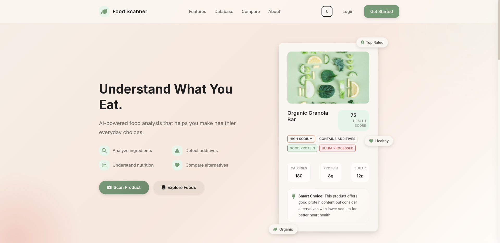
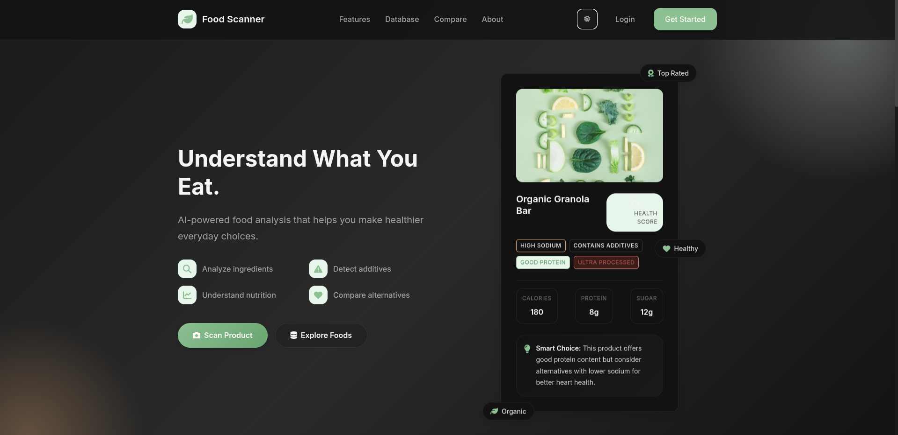
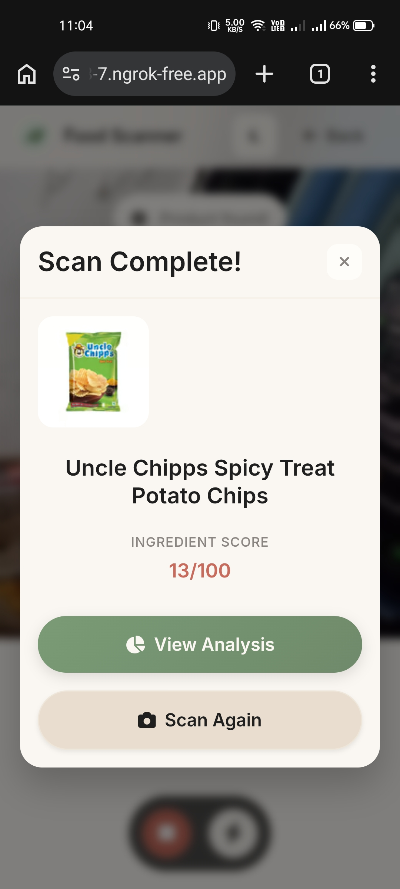
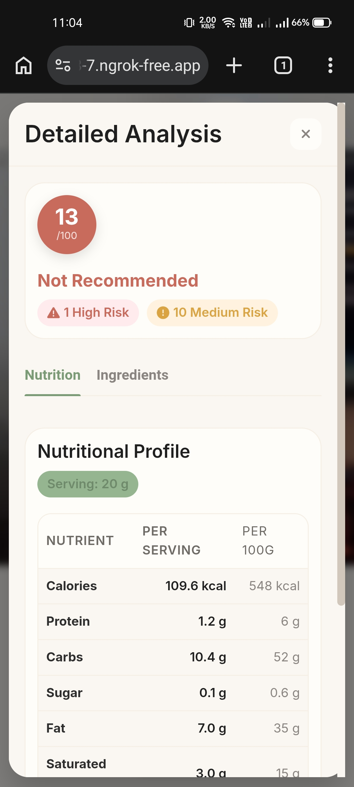
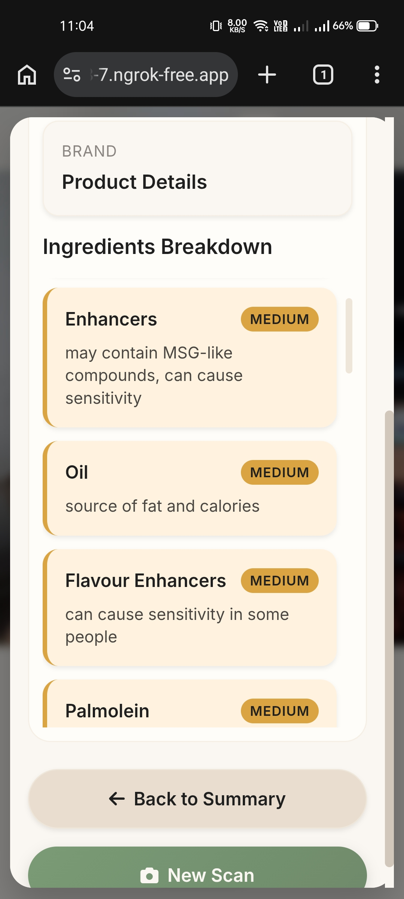
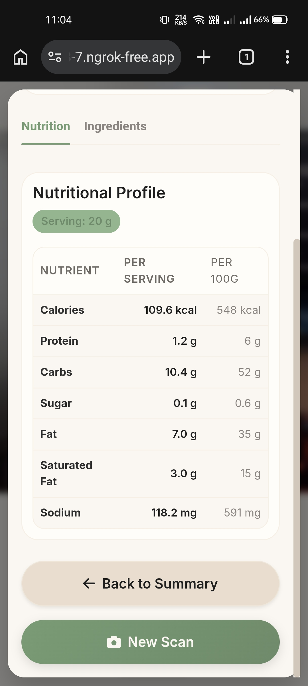

# 🥗 NutriScan: AI-Powered Food Intelligence Platform

[](https://www.oracle.com/java/)
[](https://spring.io/projects/spring-boot)
[](https://www.mysql.com/)
[](LICENSE)

### *Transforming How You See Your Food through Deep Nutritional Analysis*




---

## 📖 Overview

**NutriScan** is a professional-grade, full-stack Food Intelligence platform designed to bridge the gap between complex food labels and consumer health. Currently specialized in snack and packaged goods, the platform leverages Computer Vision and AI to identify products from simple photos and provides a comprehensive "Health Score" based on scientific nutritional analysis.

### The Problem
Most consumers find it nearly impossible to decipher long ingredient lists or understand the real impact of "hidden" sugars, artificial additives, and processing levels.

### The Vision
To empower every individual with instant, actionable food intelligence at the point of purchase, fostering a world where healthy eating is driven by data, not marketing.

---

## ✨ Features

*   **📷 Real-Time Product Scanning:** High-performance camera integration for mobile devices to capture product packaging instantly.
*   **🤖 AI-Driven Identification:** Integrated with a specialized Python-based AI service for precise product recognition.
*   **🔍 Ingredient Parsing Engine:** Automatically breaks down complex ingredient lists into categorized components.
*   **📊 Nutrition Facts Extraction:** Real-time extraction and normalization of macro and micronutrients.
*   **⚖️ Proprietary Scoring Architecture:**
    *   **Ingredient Scoring:** Weighs the health impact of every single additive and base ingredient.
    *   **Nutrient Scoring:** Normalizes values (per 100g/serving) to provide a standardized health rating.
    *   **Overall Health Verdict:** Delivers a clear "Good Choice," "Moderation," or "Not Recommended" status.
*   **🏢 Relational Food Intelligence:** A robust MySQL schema designed for high scalability and deep data relationships.
*   **📱 Mobile-First UI:** A premium, tactile web experience optimized for on-the-go wellness.

---

## 🛠️ Tech Stack

### Backend
- **Core:** Java 21
- **Framework:** Spring Boot 4.0.6 (Starters: Web, Data JPA, Security, Validation)
- **Communication:** Spring WebClient (Reactive) for AI Service orchestration
- **Utilities:** Project Lombok for boilerplate reduction

### Frontend
- **Languages:** HTML5, CSS3 (Modern Vanilla), Vanilla JavaScript (ES6+)
- **Icons & Fonts:** FontAwesome 6.4, Google Fonts (Inter, Poppins)
- **Design:** Mobile-first, responsive Glassmorphism-inspired UI

### Data & Infrastructure
- **Database:** MySQL 8.3
- **ORM:** Hibernate / Spring Data JPA
- **AI Backend:** Specialized Python AI API (Product Identification)

---

## 🏗️ System Architecture

NutriScan follows a clean, layered architecture designed for extensibility.

| Entity | Description |
| :--- | :--- |
| **Product** | The root entity containing core metadata (Name, Brand, Category, Barcode). |
| **Ingredient** | Stores individual ingredients with their `riskLevel` and `impactScore`. |
| **NutritionFact** | Detailed nutritional breakdown (Calories, Fats, Sugars, Sodium, etc.). |
| **Nutrient** | Global metadata for nutrients, defining their unit and impact weight. |
| **ProductScore** | A composite entity storing calculated health ratings and versioned notes. |

### Scalability Design
The architecture uses a **ManyToMany** relationship between `Products` and `Ingredients`, allowing the system to build a global "Knowledge Graph" of ingredients. As the database grows, the scoring engine becomes more intelligent at identifying patterns across different food categories.

---

## 🧪 Scoring System Deep-Dive

The NutriScan scoring engine is the "brain" of the platform. It moves beyond simple calorie counting to evaluate food quality.

### 1. Ingredient Scoring
Every ingredient is assigned an `impactScore` ranging from negative (harmful) to positive (beneficial).
- **Base Score:** 50
- **Formula:** `50 + Σ(Ingredient Impact Scores)`
- **Cap:** Normalized between 0 and 100.

### 2. Nutrient Scoring
Nutrients are normalized before calculation to ensure consistency:
- **Normalization Examples:** Energy (Kcal) is divided by 100, while Fibers/Proteins are divided by 10 for weightage.
- **Dynamic Logic:** The system uses Java Reflection (`Field.get`) to dynamically extract and score nutrients, making it easy to add new nutrients without code changes.

### 3. Impact Levels
- **High Risk:** Artificial preservatives, high fructose corn syrup, trans fats.
- **Medium Risk:** Refined flours, high sodium levels.
- **Low Risk:** Whole grains, natural fibers, healthy proteins.

---

## 🔄 API Analysis Flow

1.  **Image Upload:** Frontend captures a JPEG blob and hits `/api/v1/analysis/image`.
2.  **AI Identification:** Backend forwards the image to the **Python AI Client** for visual identification.
3.  **Product Retrieval:** The system performs a fuzzy search in the **MySQL database** for the identified product.
4.  **Real-Time Scoring:**
    - Service extracts ingredients and calculates the **Ingredient Score**.
    - Service extracts nutrition facts and calculates the **Nutrient Score**.
5.  **Persistence:** Results are cached in the `product_scores` table for instant future retrieval.
6.  **Response:** A rich JSON payload is returned, containing the full product profile and health verdict.

---

## 📁 Folder Structure

```text
nutriscan/
├── src/main/java/com/harsh/nutriscan/
│   ├── client/         # External AI API clients (WebClient)
│   ├── config/         # Security and bean configurations
│   ├── controller/     # REST Controllers (API Endpoints)
│   ├── entity/         # JPA Models (Database Schema)
│   ├── repository/     # Data Access Layer
│   └── service/        # Core Business Logic & Scoring Engine
├── src/main/resources/
│   ├── static/         # Frontend (HTML, CSS, JS)
│   └── application.properties # System Configuration
├── food_intelligence.sql # Database Schema Export
└── pom.xml             # Maven Project Configuration
```

---

## 🚀 Installation & Setup

### 1. Clone the Repository
```bash
git clone https://github.com/Harsh-Choudhary-Dev/FoodScanner.git
cd nutriscan
```

### 2. Database Setup
1.  Ensure MySQL is running.
2.  Create a database: `CREATE DATABASE food_intelligence;`
3.  Import the schema: `mysql -u root -p food_intelligence < food_intelligence.sql`

### 3. Configure Environment
Update `src/main/resources/application.properties`:
```properties
spring.datasource.url=jdbc:mysql://localhost:3306/food_intelligence
spring.datasource.username=YOUR_USERNAME
spring.datasource.password=YOUR_PASSWORD
food.scanner.ai.base-url=http://your-ai-service-url
```

### 4. Run the Application
```bash
./mvnw clean install
./mvnw spring-boot:run
```
Access the app at `http://localhost:8080`.

---

## 📡 Sample API Endpoints

| Method | Endpoint | Description |
| :--- | :--- | :--- |
| `POST` | `/api/v1/analysis/image` | Uploads a product image for AI identification and scoring. |
| `GET` | `/` | Serves the main landing page. |

---

## 📸 Screenshots

<div align="center">
  
  
  
  
</div>

---

## 🤝 Contributing

We welcome contributions from the community! 
1. Fork the Project.
2. Create your Feature Branch (`git checkout -b feature/AmazingFeature`).
3. Commit your Changes (`git commit -m 'Add some AmazingFeature'`).
4. Push to the Branch (`git push origin feature/AmazingFeature`).
5. Open a Pull Request.

---

## 👤 Author

**Harsh Choudhary**
- GitHub: [@Harsh-Choudhary-Dev](https://github.com/Harsh-Choudhary-Dev)
- Project: [FoodScanner](https://github.com/Harsh-Choudhary-Dev/FoodScanner)

---
*Created with ❤️ for a healthier future.*
